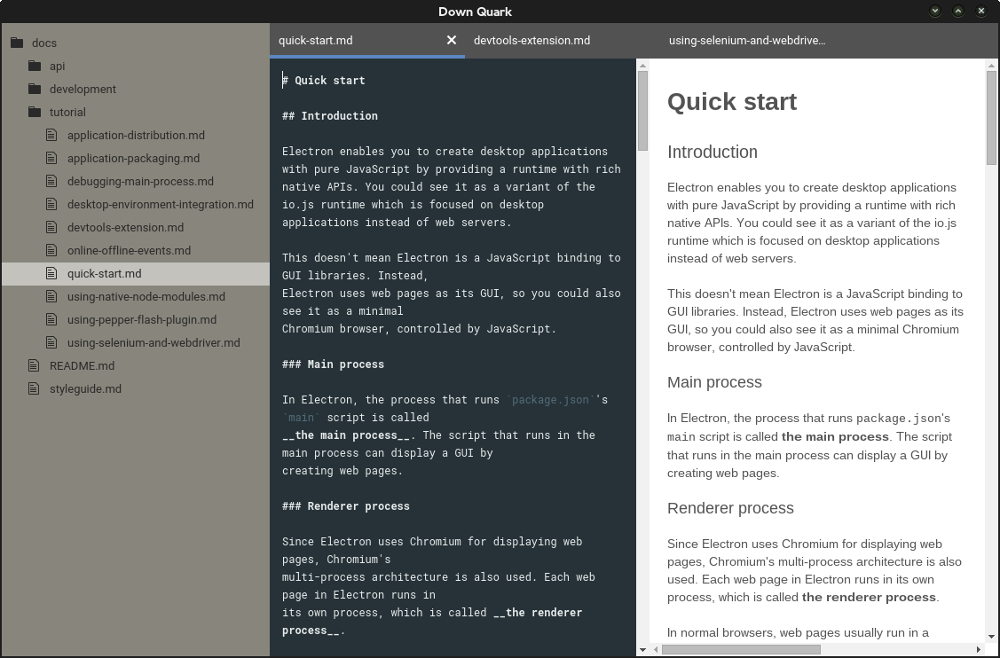

# Down Quark

**Down Quark** is a cross-platform markdown editor built on top of
[Electron](http://electron.atom.io/).

Tech stack:
- JavaScript ES6/ES7 (using [Babel](http://babeljs.io) as a transpiler)
- [Electron](http://electron.atom.io/)
- [React](http://facebook.github.io/react/)
- [CodeMirror](http://codemirror.net)



## Install and run in development mode

To install node dependencies and rebuild native modules for the electron
runtime:

```
npm run install-deps
```

To start **Down Quark** and watch for CSS and JS changes:

```
npm run watch
```

## Build for your platform

```
npm run package
```

This will package **Down Quark** for your platform and architecture.

Requirements for building on Windows:
- [Python 2.7](https://www.python.org/downloads/)
- [Visual Studio Express 2013](http://www.microsoft.com/en-gb/download/details.aspx?id=44914)
