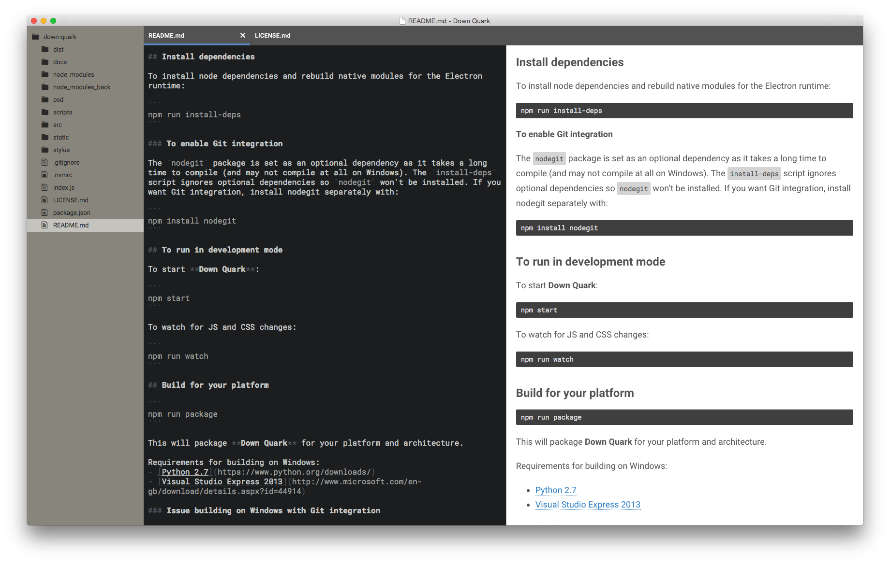

# Down Quark

**Down Quark** is a cross-platform markdown editor built on top of [Electron](http://electron.atom.io/).

Tech stack:
- JavaScript ES6/ES7 (using [Babel](http://babeljs.io) as a transpiler)
- [Electron](http://electron.atom.io/)
- [React](http://facebook.github.io/react/) with [Alt](http://alt.js.org/)
- [CodeMirror](http://codemirror.net)



## Install dependencies

The repository has two `package.json` files: one for setting up the dev environment and one for the app itself. This helps to keep dependencies separate for packaging.

First, install dev dependencies (Electron runtime and helpers as well as JS and CSS transpilers):

```
> npm install
```

To install app dependencies and rebuild native modules for the Electron runtime:

```
> npm run install-app
```

### To enable Git integration

The `nodegit` package is set as an optional dependency as it takes a long time to compile (and may not compile at all on Windows). The `install-app` script ignores optional dependencies so `nodegit` won't be installed. If you want Git integration, install `nodegit` separately with:

```
> cd app
> npm install nodegit
```

## To run in development mode

To start **Down Quark**:

```
> npm start
```

To watch for JS and CSS changes:

```
> npm run watch
```

## Build for your platform

```
> npm run package
```

This will package **Down Quark** for your platform and architecture.

Requirements for building on Windows:
- [Python 2.7](https://www.python.org/downloads/)
- [Visual Studio Express 2013](http://www.microsoft.com/en-gb/download/details.aspx?id=44914)

### Issue building on Windows with Git integration

I haven't been able to build **nodegit** for Electron on Windows. The issue has been raised here: [#738](https://github.com/nodegit/nodegit/issues/738).

## Down Quark?

Down Quark is a mark**down** editor built on Electron. The electron is an elementary particle of the standard model, as a **quarks**. [Quarks](https://en.wikipedia.org/wiki/Quark) come in 6 flavours: up, **down**, strange, charm, top and bottom.
